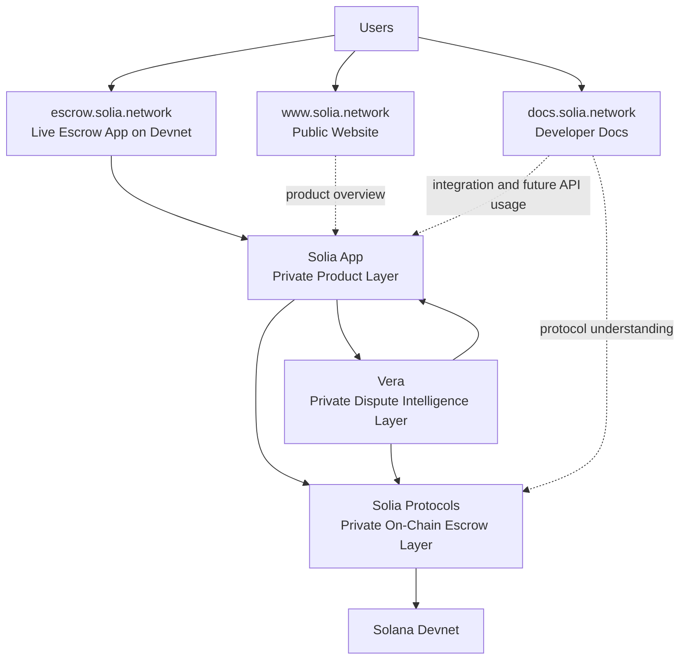

# Solia Network

> Solia is a programmable non-custodial escrow and settlement protocol on Solana for global payments, P2P trade, freelance transactions, and any workflow where trust between parties cannot be assumed.
>
> It combines on-chain escrow, a live devnet trading surface, and structured dispute resolution into one system, with public website, product app, and docs already live.

[]()
[]()
[]()
[]()
[]()

## Live Product Links

- Website: [www.solia.network](https://www.solia.network)
- Escrow App: [escrow.solia.network](https://escrow.solia.network)
- Documentation: [docs.solia.network](https://docs.solia.network)

## Judge Checklist

- Visit the public website: [www.solia.network](https://www.solia.network)
- Open the live escrow app on devnet: [escrow.solia.network](https://escrow.solia.network)
- Review the docs portal: [docs.solia.network](https://docs.solia.network)
- Verify the deployed Solia escrow program on Solana Devnet
- Evaluate the buy and sell order flow
- Evaluate escrow-backed settlement flow
- Evaluate dispute escalation and evidence attribution workflow
- Evaluate the modular architecture across app, protocol, and Vera
- Evaluate whether Solia solves a real trust problem for P2P and freelance payments

## How to Test Solia

Judges can test Solia through its live public surfaces and devnet deployment.

### Public Links

- Website: [https://www.solia.network](https://www.solia.network)
- Escrow App: [https://escrow.solia.network](https://escrow.solia.network)
- Docs: [https://docs.solia.network](https://docs.solia.network)

### Devnet Program

`SOLIA_ESCROW_PROGRAM_ID=J9GcXnuwFQZqpA7rSXSt44Dt4zhtyZ1RQPZdSYfXWkpt`

Example verification command:

```bash
solana program show J9GcXnuwFQZqpA7rSXSt44Dt4zhtyZ1RQPZdSYfXWkpt --url devnet
```

### Judge Test Path

1. Open `www.solia.network` to understand the product and context.
2. Open `escrow.solia.network` to access the live escrow experience on devnet.
3. Review the buy and sell order blocks.
4. Walk through trade creation and escrow-backed transaction flow.
5. Review the dispute handling path and evidence-driven resolution logic.
6. Open `docs.solia.network` to inspect product and builder documentation.
7. Verify the program deployment on Solana Devnet using the program ID above.

## Demo Flow in 60 Seconds

1. Start on `www.solia.network` to see Solia positioned as programmable escrow for global payments and P2P trade.
2. Move to `escrow.solia.network` to enter the live product.
3. Browse the order blocks for buying and selling.
4. Create or inspect an escrow-backed trade.
5. Follow the trade state from agreement to locked escrow to settlement.
6. Review how a dispute can be initiated when a transaction fails or expectations break down.
7. Show that disputes are supported by attributable evidence submission.
8. Close on `docs.solia.network` to show that Solia is being built as a real platform, not only a demo surface.

## Why Solia Should Win

- Solia targets a real coordination problem: trust-minimized payments and settlement between parties that do not know each other.
- The product is not just a smart contract demo. It already has a public website, a live devnet escrow app, and a documentation surface.
- Disputes are treated as a first-class product and protocol concern, not an afterthought.
- The architecture is modular and credible: user experience, on-chain protocol, and dispute intelligence are clearly separated.
- Solana is used for the parts it is actually good at: fast settlement, low fees, and programmable on-chain escrow state.

## Product Overview

Solia Network is a non-custodial escrow protocol built on Solana for peer-to-peer transactions where trust is weak and transaction risk is high.

Instead of sending funds directly to another party and hoping the transaction completes fairly, users lock funds into escrow. Funds are only released when trade conditions are met, both parties confirm completion, or a dispute is resolved through a structured workflow.

### The Problem

Peer-to-peer transactions still break down in the same places:

- buyers fear paying before delivery
- sellers fear delivering before payment
- existing escrow systems are often centralized, opaque, slow, or expensive
- disputes are usually handled manually with weak evidence trails and poor accountability

This is especially painful in freelance work, informal digital commerce, service delivery, and cross-border peer transactions.

### The Solia Approach

Solia replaces trust in the counterparty with verifiable escrow logic on Solana.

Core design goals:

- non-custodial fund locking
- clear trade state transitions
- mutual confirmation before settlement
- structured evidence submission during disputes
- admin-led resolution workflow with Vera assisting dispute analysis

### Product Surfaces

#### Main Website

`www.solia.network` is the public entry point for Solia. It presents the product thesis clearly: programmable escrow for global payments, P2P trade, and freelance settlement.

#### Escrow Trading App

`escrow.solia.network` is the live product surface for escrow trades.

Current known scope:

- order blocks for buying and selling
- live deployment on devnet
- escrow-driven trade interaction flow

#### Documentation Portal

`docs.solia.network` contains Solia documentation for builders, product understanding, and future API usage.

### How It Works

1. A trade is created with agreed terms between buyer and seller.
2. Funds are locked into escrow on-chain.
3. The counterparty accepts the trade.
4. The trade is completed when both sides confirm the outcome.
5. If something goes wrong, either side can trigger a dispute.
6. Evidence is submitted with clear attribution by role.
7. Vera helps structure and analyze the dispute workflow.
8. Resolution determines whether funds are released, refunded, or otherwise settled.

### Architecture Diagram



### Architecture

Solia is organized into three connected components:

#### 1. Solia App

Private mobile application for user-facing flows:

- trade creation and acceptance
- escrow interaction
- dispute submission
- user activity and transaction experience

Repository:
`https://github.com/Solia-Network/solia_app.git`

#### 2. Solia Protocols

Private on-chain protocol layer for escrow execution:

- escrow account logic
- fund locking
- settlement rules
- dispute-triggered state transitions

Repository:
`https://github.com/Solia-Network/solia_protocols.git`

#### 3. Vera

Private dispute intelligence layer for structured conflict handling:

- evidence processing
- dispute workflow support
- conflict analysis
- admin-facing decision support

Repository:
`https://github.com/Solia-Network/vera-solia.git`

### Why Solana

Solana is a strong fit for Solia because it enables:

- fast transaction finality for real-time trade flows
- low fees for frequent escrow interactions
- on-chain state management for dispute-aware settlement logic
- scalable infrastructure for high-volume P2P transaction networks

### What Makes Solia Different

- Non-custodial by design: funds are controlled by protocol logic, not a centralized intermediary.
- Dispute-aware escrow: dispute handling is built into the product flow, not bolted on later.
- Evidence-first resolution: disputes are structured around attributable submissions, reducing ambiguity.
- Modular system design: app, protocol, and dispute intelligence are separated for clarity and extensibility.

## Current Live Status

- Public website is live
- Escrow application is live on devnet
- Documentation portal is live
- Solia is actively being developed for the Colosseum Hackathon 2026

## Current Progress

The following parts are already implemented in the current system:

- live website deployed at `www.solia.network`
- live escrow application deployed at `escrow.solia.network`
- live docs portal deployed at `docs.solia.network`
- order block trading flow for buying and selling
- dispute workflow implemented and tested with real scenarios
- evidence submission with explicit attribution for buyer, seller, and admin
- admin dispute initialization and queue handling
- Vera integration for structured dispute analysis

## Proof of Execution

- Public website is live at [https://www.solia.network](https://www.solia.network)
- Live escrow application is running at [https://escrow.solia.network](https://escrow.solia.network)
- Documentation portal is live at [https://docs.solia.network](https://docs.solia.network)
- Solia escrow program is deployed on Solana Devnet
- Program ID: `J9GcXnuwFQZqpA7rSXSt44Dt4zhtyZ1RQPZdSYfXWkpt`
- Buy and sell order block flow is already present in the escrow product surface
- Dispute workflow has been implemented and tested with real scenarios
- Evidence submission includes explicit attribution by role
- Admin dispute queue and initialization workflow are implemented
- Vera is integrated into the structured dispute analysis flow

## Screenshots

Add real screenshots in this section before final submission.

### 1. Landing Page

Caption: Solia's public website introducing programmable escrow for global payments, P2P trade, and freelance settlement.

Placeholder path:
`./assets/screenshots/landing-page.png`

### 2. Escrow Marketplace

Caption: Live devnet escrow trading interface showing buy and sell order blocks.

Placeholder path:
`./assets/screenshots/escrow-marketplace.png`

### 3. Trade Creation Flow

Caption: User flow for creating an escrow-backed trade with defined transaction terms.

Placeholder path:
`./assets/screenshots/trade-creation.png`

### 4. Trade Details and Escrow State

Caption: Trade detail view showing escrow status, counterparties, and current settlement state.

Placeholder path:
`./assets/screenshots/trade-details.png`

### 5. Dispute Submission

Caption: Structured dispute flow with role-based evidence submission.

Placeholder path:
`./assets/screenshots/dispute-submission.png`

### 6. Admin Dispute Queue

Caption: Admin workflow for reviewing, initializing, and resolving disputes.

Placeholder path:
`./assets/screenshots/admin-dispute-queue.png`

### 7. Documentation Portal

Caption: Solia documentation portal for builders, integration guidance, and future API usage.

Placeholder path:
`./assets/screenshots/docs-portal.png`

## Repository Scope

This repository serves as the public project overview for Solia Network.

Because the product is still in active development, the main implementation repositories are private at this stage:

- `solia_app`
- `solia_protocols`
- `vera-solia`

For hackathon judging, this repo is meant to give clear public context around:

- the product vision
- the live surfaces already available
- the system architecture
- the escrow and dispute workflow
- the broader Solia ecosystem across private implementation repositories

## Status

Solia Network is in active development as part of the Colosseum Hackathon 2026.

## Contact

If you plan to share a demo, judge access notes, or private repo access instructions, add them here before submission.
