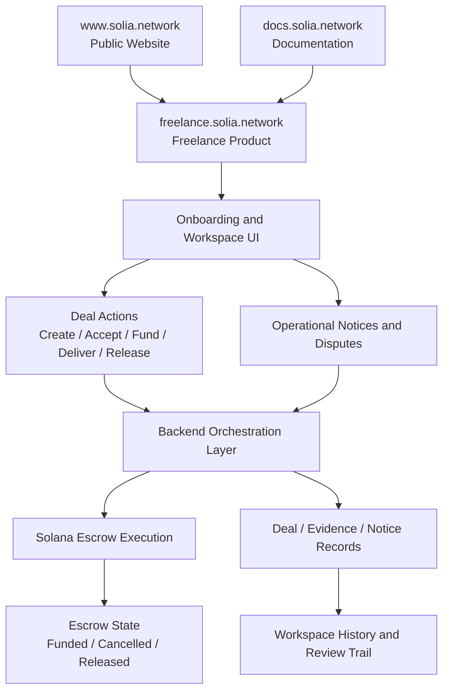
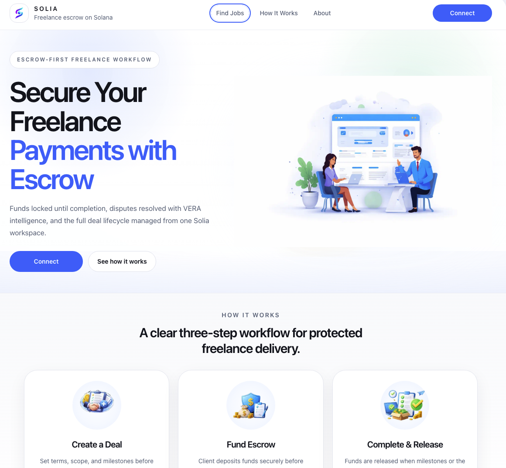
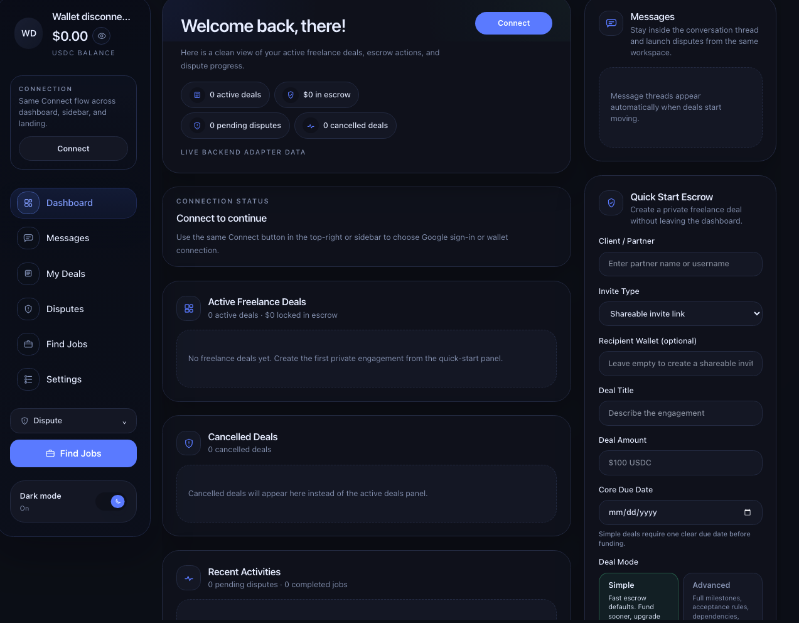
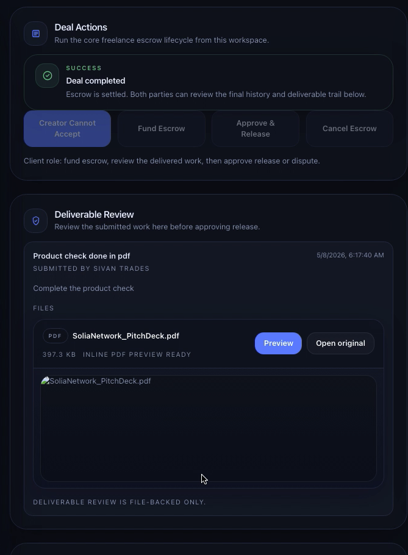
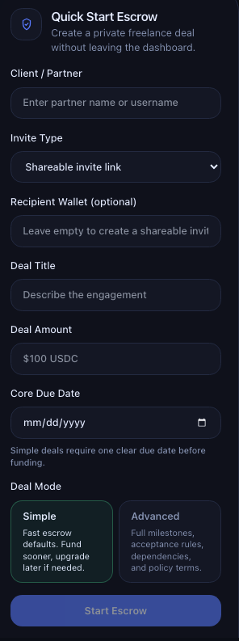
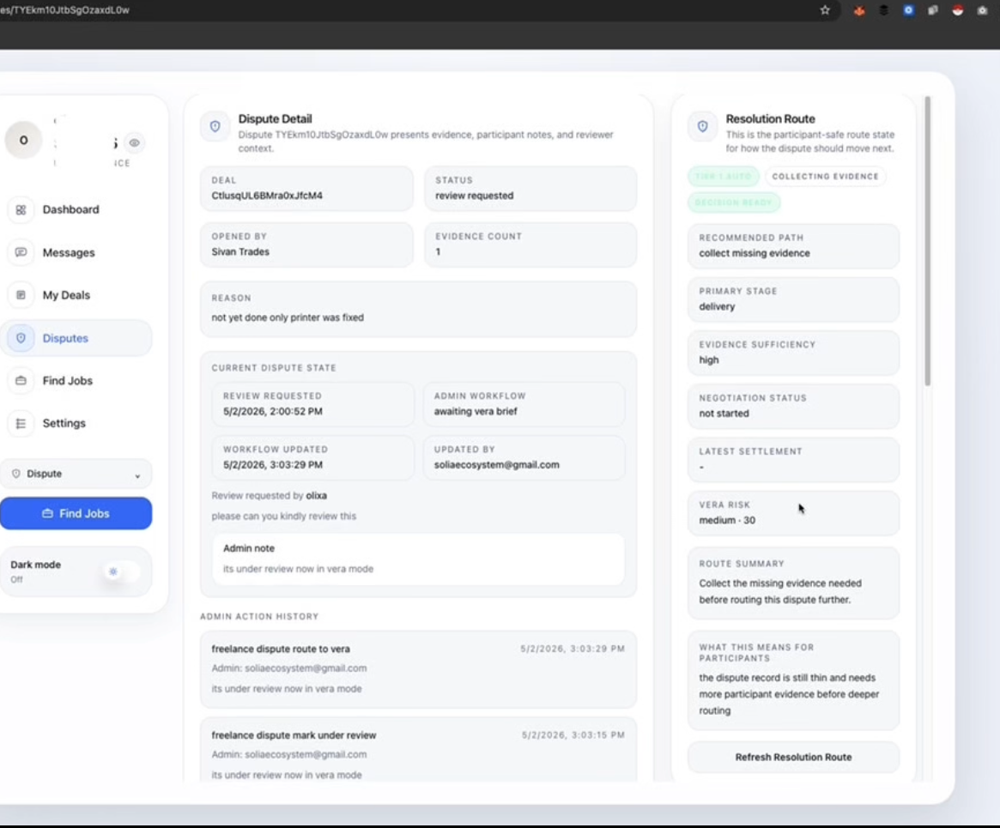

# Solia Network

Solia is a programmable non-custodial escrow and settlement protocol on Solana for freelance transactions, global payments, and any workflow where trust between parties cannot be assumed.

It combines on-chain escrow, a live freelance product surface, and structured dispute resolution into one system, with the website, app, and docs already live.

## Live Product

- Freelance app: `https://freelance.solia.network`
- Main website: `https://www.solia.network`
- Docs: `https://docs.solia.network`

## Judge Quick Start

If you only have a few minutes, use this path:

1. Open `https://freelance.solia.network`
2. Connect and enter the freelance workspace
3. Inspect the deal lifecycle:
   - create
   - accept
   - fund
   - deliver
   - release or dispute
4. Open `https://docs.solia.network` for supporting context
5. Use this repo to navigate the implementation repositories

## Submission Focus

This repository is the public index for Solia's hackathon submission. The current submission is centered on freelance escrow, not a broad generic payments app.

Included in scope today:

- private freelance deal creation
- invite-based collaboration between client and freelancer
- escrow-backed funding flow
- deliverable submission flow
- release and dispute workflow
- dashboard and workspace management for both sides

## What Solia Does

Solia turns freelance payments into an escrow-backed workflow on Solana.

Instead of trusting the counterparty directly, users work through a structured deal lifecycle:

1. Create a freelance deal
2. Share or accept the invite
3. Fund escrow on-chain
4. Submit the deliverable
5. Release funds or open a dispute

## Problem

Freelance payments still break for the same reasons:

- clients do not want to pay before work is delivered
- freelancers do not want to deliver before funds are locked
- off-chain escrow is slow, opaque, and operationally expensive
- disputes usually have weak evidence trails and poor process clarity

Solia addresses that by keeping escrow state, workflow state, and dispute state inside one product system.

## Why Solana

Solana is a strong fit because Solia needs:

- low-cost transaction flow for repeated escrow actions
- fast finality for deal state changes
- programmable escrow logic
- a credible path to higher-volume payment coordination

## Architecture Flow

Solia is organized across three practical layers:

1. Product layer: `freelance.solia.network` and the end-user workspace
2. Protocol and service layer: escrow execution, API orchestration, dispute records, and Solana-connected actions
3. Public layer: `www.solia.network`, `docs.solia.network`, and this public overview repo

### Flow Summary

1. A user starts at `www.solia.network` or directly enters `freelance.solia.network`.
2. The freelance frontend handles onboarding, workspace access, deal creation, and participant actions.
3. The backend coordinates deal state, validation, uploads, dispute records, and action routing.
4. Escrow-critical actions such as funding, cancel, and release resolve against the Solana execution layer.
5. Disputes and operational notices stay attached to the same workspace so deal state and evidence stay coherent.
6. `docs.solia.network` supports product understanding and technical review.

### Mermaid Diagram

## Component Repositories

The implementation is split across two focused repositories:

### Freelance Frontend
- Repo: `https://github.com/SoliaNetwork/solia-freelance-ui`
- Responsibility: onboarding, dashboard, workspace flows, deal UX, dispute UX, and wallet integration

### Protocol and Backend
- Repo: `https://github.com/Solia-Network/solia_contracts`
- Responsibility: escrow execution, API orchestration, deal state, dispute records, evidence handling, and Solana-connected actions

## Visual Proof

The repo is wired for a public screenshot set under `screenshots/`.

### Screenshot Index

1. Landing hero  
   `screenshots/landing-hero.png`
2. Dashboard workspace  
   `screenshots/dashboard-workspace.png`
3. Deal actions panel  
   `screenshots/deal-actions.png`
4. Quick-start escrow form  
   `screenshots/quick-start-escrow.png`
5. Dispute / notice workflow  
   `screenshots/dispute-notice-workflow.png`

### README Preview Wiring

#### 1. Landing Hero

#### 2. Dashboard Workspace

#### 3. Deal Actions

#### 4. Quick Start Escrow

#### 5. Dispute / Notice Workflow

If the PNG files are not added yet, the placeholder markdown files in `screenshots/` show the intended asset names. Replace those placeholders with the real images using the same filenames.

## Why This Submission Is Credible

- there is a live product surface, not only mockups
- the workflow is centered on a real trust problem
- escrow is part of the core product logic
- dispute handling is included in the system design
- product and protocol responsibilities are split cleanly

## Status

- submission focus: freelance escrow on Solana
- environment: active product testing
- main product URL: `https://freelance.solia.network`
- public overview URL: `https://www.solia.network`

## Review Note

Start with `freelance.solia.network`, then use this repo to navigate the implementation repositories.
